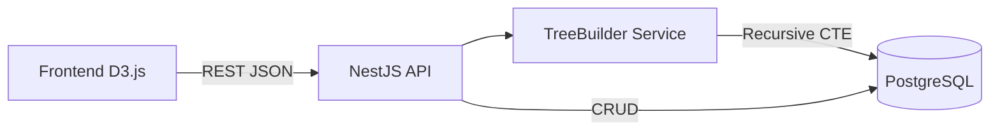
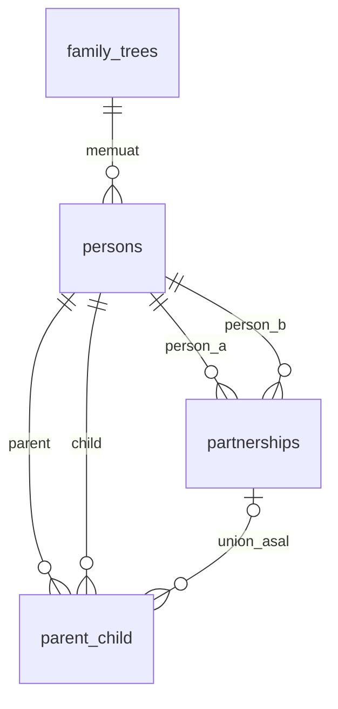
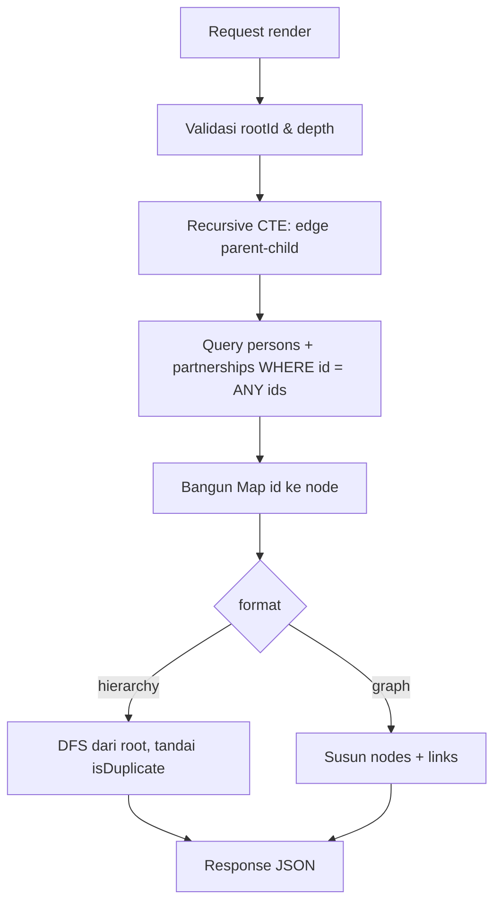

# SRS Backend Family Tree (NestJS + PostgreSQL)

*Sep 23, 2026 · @Someone*

## 1. Pendahuluan

Dokumen ini mendefinisikan kebutuhan backend (NestJS + PostgreSQL) yang menyimpan data silsilah dan menghasilkan struktur family tree dalam format JSON siap pakai untuk D3.js.

Ruang lingkup fase 1: kelola data orang dan relasinya, lalu generate tree untuk ditampilkan. Frontend, autentikasi, dan fitur kolaborasi berada di luar lingkup.

| Istilah | Arti |
|---|---|
| Tree | Satu silsilah keluarga (wadah data), misalnya "Keluarga Besar Wiryo" |
| Person | Satu individu di dalam tree |
| Parent-child | Relasi orang tua ke anak yang disimpan: biologis, adopsi, asuh, atau wali |
| Union (partnership) | Satu periode hubungan pasangan; satu person bisa punya banyak union, termasuk menikah ulang dengan orang yang sama |
| Anak angkat | Anak dengan relasi `adopted`; relasi dengan orang tua kandungnya tetap boleh disimpan |
| Anak asuh / wali | Relasi `foster` / `guardian`, berbatas waktu dan tidak mengubah garis keturunan |
| Anak tiri | Anak dari pasangan yang bukan anak sendiri; dihitung otomatis, tidak disimpan |
| Saudara seayah / seibu | Saudara yang hanya berbagi satu orang tua; dihitung otomatis dari union asal |
| Root person | Orang yang menjadi titik awal saat tree di-generate |
| Descendants | Semua keturunan dari root person |

## 2. Gambaran Umum Sistem

Backend berperan sebagai REST API tunggal: menyimpan data di PostgreSQL, memvalidasi relasi, dan menghitung struktur tree di sisi server sehingga frontend D3.js cukup merender.



Frontend memanggil endpoint CRUD untuk mengisi data, lalu memanggil endpoint generate tree yang mengembalikan JSON siap `d3.hierarchy()` atau format nodes/links.

**Asumsi:**

- Satu tree dimiliki satu admin; belum ada multi-user atau hak akses per tree.
- Ukuran tree yang ditargetkan hingga 5.000 person per tree.
- ORM: TypeORM (integrasi bawaan NestJS); query rekursif memakai raw SQL.
- Semua ID memakai UUID v4.

## 3. Kebutuhan Fungsional

Fase 1 terdiri dari 22 kebutuhan fungsional; FR-13 sampai FR-16 (generate tree) adalah inti yang dikonsumsi D3.js, dan FR-17 sampai FR-22 menangani relasi kompleks.

| Istilah | Arti |
|---|---|
| Ancestors | Semua leluhur dari root person (pedigree) |
| Depth | Jumlah generasi yang ditelusuri dari root |

| ID | Kebutuhan | Prioritas |
|---|---|---|
| FR-01 | Membuat tree baru (nama, deskripsi, root person opsional) | Wajib |
| FR-02 | Melihat daftar tree dengan pagination | Wajib |
| FR-03 | Mengubah dan menghapus tree (hapus = cascade ke person dan relasi) | Wajib |
| FR-04 | Menambah person ke tree | Wajib |
| FR-05 | Melihat detail person beserta orang tua, anak, dan semua union-nya | Wajib |
| FR-06 | Mengubah dan menghapus person (relasinya ikut terhapus) | Wajib |
| FR-07 | Mencari person dalam tree berdasarkan nama | Sebaiknya |
| FR-08 | Menambah relasi orang tua–anak dengan tipe biologis, adopsi, asuh, atau wali | Wajib |
| FR-09 | Menghapus relasi orang tua–anak | Wajib |
| FR-10 | Menambah union dengan status menikah, cerai, cerai mati, dibatalkan, pisah, atau pasangan | Wajib |
| FR-11 | Mengubah dan menghapus union | Wajib |
| FR-12 | Menolak relasi yang melanggar aturan bisnis (bagian 5) | Wajib |
| FR-13 | Generate tree keturunan (descendants) dari root person | Wajib |
| FR-14 | Generate tree leluhur (ancestors) dari root person | Wajib |
| FR-15 | Membatasi kedalaman generate dengan parameter depth | Wajib |
| FR-16 | Mengembalikan output dalam format hierarchy atau graph | Wajib |
| FR-17 | Mencatat lebih dari satu union per person, berurutan maupun bersamaan (poligami), termasuk rujuk dengan orang yang sama | Wajib |
| FR-18 | Menautkan anak ke union asalnya agar anak dari pernikahan berbeda bisa dibedakan | Wajib |
| FR-19 | Mencatat anak angkat tanpa menghapus relasi dengan orang tua kandungnya | Wajib |
| FR-20 | Mencatat anak asuh dan wali dengan tanggal mulai dan selesai | Sebaiknya |
| FR-21 | Menghitung relasi turunan (anak tiri, orang tua tiri, saudara seayah/seibu) saat render | Wajib |
| FR-22 | Memfilter tipe relasi dan status union yang ikut dirender | Sebaiknya |

## 4. Model Data PostgreSQL

Data disimpan dalam 4 tabel: relasi orang tua–anak dan relasi pasangan dipisah karena sifatnya berbeda (berarah vs tidak berarah).



| Tabel | Kolom utama | Catatan |
|---|---|---|
| family_trees | id, name, description, root_person_id, allow_concurrent_partnerships, created_at, updated_at | `allow_concurrent_partnerships` mengizinkan poligami (default true) |
| persons | id, tree_id, first_name, last_name, nickname, gender, birth_date, death_date, is_living, photo_url, notes | gender: male, female, unknown |
| partnerships | id, tree_id, person_a_id, person_b_id, status, start_date, end_date, notes | Satu baris = satu union; pasangan yang sama boleh punya beberapa baris selama periodenya tidak tumpang tindih |
| parent_child | id, tree_id, parent_id, child_id, relation_type, partnership_id, start_date, end_date | relation_type: biological, adopted, foster, guardian; partnership_id = union asal anak |

```sql
CREATE EXTENSION IF NOT EXISTS btree_gist;

CREATE TYPE gender_type AS ENUM ('male', 'female', 'unknown');
CREATE TYPE parent_relation_type AS ENUM ('biological', 'adopted', 'foster', 'guardian');
CREATE TYPE partnership_status AS ENUM (
  'married',   -- menikah, masih berjalan
  'partner',   -- pasangan tanpa ikatan nikah
  'separated', -- pisah ranjang, belum cerai
  'divorced',  -- cerai hidup
  'widowed',   -- cerai mati
  'annulled'   -- pernikahan dibatalkan
);

CREATE TABLE family_trees (
  id UUID PRIMARY KEY DEFAULT gen_random_uuid(),
  name VARCHAR(150) NOT NULL,
  description TEXT,
  root_person_id UUID,
  allow_concurrent_partnerships BOOLEAN NOT NULL DEFAULT true,
  created_at TIMESTAMPTZ NOT NULL DEFAULT now(),
  updated_at TIMESTAMPTZ NOT NULL DEFAULT now()
);

CREATE TABLE persons (
  id UUID PRIMARY KEY DEFAULT gen_random_uuid(),
  tree_id UUID NOT NULL REFERENCES family_trees(id) ON DELETE CASCADE,
  first_name VARCHAR(100) NOT NULL,
  last_name VARCHAR(100),
  nickname VARCHAR(100),
  gender gender_type NOT NULL DEFAULT 'unknown',
  birth_date DATE,
  death_date DATE,
  is_living BOOLEAN NOT NULL DEFAULT true,
  photo_url TEXT,
  notes TEXT,
  created_at TIMESTAMPTZ NOT NULL DEFAULT now(),
  updated_at TIMESTAMPTZ NOT NULL DEFAULT now(),
  CONSTRAINT chk_death_after_birth
    CHECK (death_date IS NULL OR birth_date IS NULL OR death_date >= birth_date)
);

ALTER TABLE family_trees
  ADD CONSTRAINT fk_root_person
  FOREIGN KEY (root_person_id) REFERENCES persons(id) ON DELETE SET NULL;

CREATE TABLE partnerships (
  id UUID PRIMARY KEY DEFAULT gen_random_uuid(),
  tree_id UUID NOT NULL REFERENCES family_trees(id) ON DELETE CASCADE,
  person_a_id UUID NOT NULL REFERENCES persons(id) ON DELETE CASCADE,
  person_b_id UUID NOT NULL REFERENCES persons(id) ON DELETE CASCADE,
  status partnership_status NOT NULL DEFAULT 'married',
  start_date DATE,
  end_date DATE,
  notes TEXT,
  created_at TIMESTAMPTZ NOT NULL DEFAULT now(),
  CONSTRAINT chk_partner_order CHECK (person_a_id < person_b_id),
  CONSTRAINT chk_partnership_dates
    CHECK (end_date IS NULL OR start_date IS NULL OR end_date >= start_date),
  -- pasangan yang sama boleh menikah ulang, asal periodenya tidak tumpang tindih
  CONSTRAINT ex_partnership_overlap EXCLUDE USING gist (
    person_a_id WITH =,
    person_b_id WITH =,
    daterange(start_date, end_date, '[)') WITH &&
  )
);

CREATE TABLE parent_child (
  id UUID PRIMARY KEY DEFAULT gen_random_uuid(),
  tree_id UUID NOT NULL REFERENCES family_trees(id) ON DELETE CASCADE,
  parent_id UUID NOT NULL REFERENCES persons(id) ON DELETE CASCADE,
  child_id UUID NOT NULL REFERENCES persons(id) ON DELETE CASCADE,
  relation_type parent_relation_type NOT NULL DEFAULT 'biological',
  partnership_id UUID REFERENCES partnerships(id) ON DELETE SET NULL,
  start_date DATE, -- tanggal adopsi / mulai diasuh
  end_date DATE,   -- akhir pengasuhan / perwalian
  created_at TIMESTAMPTZ NOT NULL DEFAULT now(),
  CONSTRAINT uq_parent_child UNIQUE (parent_id, child_id),
  CONSTRAINT chk_not_self_parent CHECK (parent_id <> child_id),
  CONSTRAINT chk_pc_dates
    CHECK (end_date IS NULL OR start_date IS NULL OR end_date >= start_date)
);

CREATE INDEX idx_persons_tree ON persons(tree_id);
CREATE INDEX idx_persons_name ON persons(tree_id, lower(first_name), lower(last_name));
CREATE INDEX idx_pc_parent ON parent_child(parent_id);
CREATE INDEX idx_pc_child ON parent_child(child_id);
CREATE INDEX idx_pc_partnership ON parent_child(partnership_id);
CREATE INDEX idx_partner_a ON partnerships(person_a_id);
CREATE INDEX idx_partner_b ON partnerships(person_b_id);
```

`chk_partner_order` menyimpan pasangan dalam urutan ID tetap, sehingga `ex_partnership_overlap` bisa mendeteksi union ganda A–B maupun B–A; service wajib mengurutkan kedua ID sebelum insert. `daterange` dengan tanggal kosong dianggap tak berbatas, jadi menikah ulang dengan orang yang sama wajib mengisi `start_date` dan `end_date` union sebelumnya.

### 4.1 Pemodelan Relasi Kompleks

Relasi yang disimpan hanya union dan parent-child; relasi tiri dan saudara seayah/seibu dihitung saat render agar data tidak pernah saling bertentangan.

| Skenario | Cara dicatat | Hasil saat render |
|---|---|---|
| Menikah lebih dari sekali (berurutan) | Beberapa baris partnerships; union lama berstatus divorced / widowed / annulled | unions diurutkan per start_date dengan order 1, 2, … |
| Poligami (bersamaan) | Beberapa union aktif sekaligus; hanya jika `allow_concurrent_partnerships = true` | Semua union aktif bertanda `isCurrent: true` |
| Cerai lalu rujuk dengan orang yang sama | Dua baris partnerships untuk pasangan yang sama, periode tidak tumpang tindih | Dua union terpisah; anak ditautkan ke union masing-masing |
| Cerai mati | status widowed, end_date = death_date pasangan | Union tampil dengan status widowed |
| Anak dari pernikahan kedua | parent_child.partnership_id = union kedua, untuk kedua orang tua | children bisa dikelompokkan per unionId |
| Anak di luar nikah / orang tua tunggal | partnership_id null; boleh hanya satu parent | unionId: null |
| Anak angkat | Relasi adopted ke orang tua angkat; relasi biological ke orang tua kandung tetap disimpan bila diketahui | Anak muncul di dua keluarga; di format hierarchy salah satunya isDuplicate |
| Diadopsi orang tua tiri | Relasi adopted dari orang tua tiri, partnership_id = union dengan orang tua kandung | relationType adopted, tidak lagi dihitung sebagai anak tiri |
| Anak asuh / wali | Relasi foster / guardian dengan start_date dan end_date | Tidak ikut render default; aktifkan lewat relationTypes |
| Anak tiri | Tidak disimpan: anak dari pasangan yang tidak punya relasi dengan person ini | Muncul jika `includeStepChildren=true`, relationType: step, isDerived: true |
| Saudara seayah / seibu | Tidak disimpan: berbagi satu orang tua, union asal berbeda | Terlihat dari unionId berbeda di bawah parent yang sama |
| Orang tua tidak diketahui | Relasi tidak dibuat | Node tanpa parent di arah ancestors |
| Menikah dengan kerabat (misal sepupu) | Relasi biasa | isDuplicate di hierarchy; di graph tanpa duplikasi |

## 5. Aturan Bisnis dan Validasi

Setiap penambahan relasi divalidasi di service layer sebelum insert; pelanggaran mengembalikan HTTP 422 dengan kode error spesifik.

| ID | Aturan | Kode error |
|---|---|---|
| BR-01 | Person tidak boleh menjadi orang tua atau pasangan dirinya sendiri | SELF_RELATION |
| BR-02 | Semua person dalam satu relasi harus berada di tree yang sama | CROSS_TREE_RELATION |
| BR-03 | Maksimal 2 orang tua bertipe biological per person; orang tua adopted, foster, guardian tidak dibatasi | MAX_BIOLOGICAL_PARENTS |
| BR-04 | Relasi parent-child jenis apa pun tidak boleh membentuk siklus | CYCLE_DETECTED |
| BR-05 | Satu pasangan parent–child hanya punya satu tipe relasi (tidak bisa sekaligus biological dan adopted dari orang yang sama) | DUPLICATE_RELATION |
| BR-06 | Jika kedua tanggal ada, birth_date child harus setelah birth_date parent biologis | INVALID_BIRTH_ORDER |
| BR-07 | death_date tidak boleh sebelum birth_date; jika death_date diisi, is_living = false | INVALID_DATES |
| BR-08 | end_date tidak boleh sebelum start_date (union dan parent-child); tanggal adopsi tidak boleh sebelum birth_date anak | INVALID_DATES |
| BR-09 | Seseorang tidak boleh sekaligus orang tua dan pasangan dari orang yang sama | CONFLICTING_RELATION |
| BR-10 | root_person_id tree harus person di tree tersebut | CROSS_TREE_RELATION |
| BR-11 | Periode union pasangan yang sama tidak boleh tumpang tindih; union ulang wajib punya start_date | OVERLAPPING_PARTNERSHIP |
| BR-12 | Jika `allow_concurrent_partnerships = false`, person tidak boleh punya dua union aktif (married, partner, separated tanpa end_date) sekaligus | CONCURRENT_PARTNERSHIP |
| BR-13 | partnership_id pada parent-child harus union yang salah satu anggotanya adalah parent tersebut | INVALID_UNION |
| BR-14 | Jika anak punya dua orang tua biologis yang sama-sama menautkan union, keduanya harus menunjuk union yang sama | INVALID_UNION |
| BR-15 | start_date union tidak boleh setelah death_date salah satu pasangan; status widowed hanya jika salah satu pasangan sudah punya death_date | INVALID_DATES |
| BR-16 | Union aktif otomatis tidak diubah saat pasangan diisi death_date; API mengembalikan warning UNION_STILL_ACTIVE agar status diubah ke widowed | — (warning) |

**Deteksi siklus (BR-04):** sebelum menyimpan relasi parent → child, jalankan query berikut; jika menghasilkan baris, tolak relasi.

```sql
WITH RECURSIVE ancestors AS (
  SELECT parent_id FROM parent_child WHERE child_id = $1 -- $1 = calon parent
  UNION
  SELECT pc.parent_id
  FROM parent_child pc
  JOIN ancestors a ON pc.child_id = a.parent_id
)
SELECT 1 FROM ancestors WHERE parent_id = $2 LIMIT 1; -- $2 = calon child
```

Validasi dan insert dijalankan dalam satu transaksi yang diawali `pg_advisory_xact_lock(hashtext(tree_id))`, agar dua request bersamaan pada tree yang sama tidak lolos membentuk siklus atau union aktif ganda (BR-12).

## 6. Spesifikasi REST API

Semua endpoint berada di bawah prefix `/api/v1`, menerima dan mengembalikan JSON, dan terdokumentasi otomatis lewat Swagger di `/api/docs`.

| Method | Endpoint | Fungsi | FR |
|---|---|---|---|
| POST | /trees | Buat tree | FR-01 |
| GET | /trees?page=&limit= | Daftar tree | FR-02 |
| GET | /trees/:treeId | Detail tree | FR-02 |
| PATCH | /trees/:treeId | Ubah tree | FR-03 |
| DELETE | /trees/:treeId | Hapus tree | FR-03 |
| POST | /trees/:treeId/persons | Tambah person | FR-04 |
| GET | /trees/:treeId/persons?q=&page=&limit= | Daftar / cari person | FR-07 |
| GET | /trees/:treeId/persons/:personId | Detail person + relasi langsung | FR-05 |
| PATCH | /trees/:treeId/persons/:personId | Ubah person | FR-06 |
| DELETE | /trees/:treeId/persons/:personId | Hapus person | FR-06 |
| POST | /trees/:treeId/parent-child | Tambah relasi orang tua–anak | FR-08 |
| DELETE | /trees/:treeId/parent-child/:id | Hapus relasi orang tua–anak | FR-09 |
| POST | /trees/:treeId/partnerships | Tambah relasi pasangan | FR-10 |
| PATCH | /trees/:treeId/partnerships/:id | Ubah relasi pasangan | FR-11 |
| DELETE | /trees/:treeId/partnerships/:id | Hapus relasi pasangan | FR-11 |
| GET | /trees/:treeId/render | Generate tree untuk D3.js | FR-13–16 |

### Parameter `GET /trees/:treeId/render`

| Parameter | Tipe | Default | Keterangan |
|---|---|---|---|
| rootId | UUID | root_person_id tree | Titik awal; 400 jika keduanya kosong |
| direction | descendants \| ancestors | descendants | Arah penelusuran |
| depth | integer 1–20 | 5 | Batas generasi |
| format | hierarchy \| graph | hierarchy | Bentuk output (bagian 7) |
| includePartners | boolean | true | Sertakan union di setiap node |
| relationTypes | CSV: biological, adopted, foster, guardian | biological,adopted | Tipe relasi parent-child yang ditelusuri |
| unionStatuses | CSV status union | semua status | Status union yang ditampilkan, misal tanpa annulled |
| includeStepChildren | boolean | false | Tambahkan anak tiri turunan (hanya descendants) |

### Contoh request

```http
POST /api/v1/trees/7c1e.../parent-child
Content-Type: application/json

{
  "parentId": "a1b2...",
  "childId": "c3d4...",
  "relationType": "biological",
  "partnershipId": "u001..."
}
```

Rujuk dengan pasangan yang sama = union baru, setelah union lama ditutup:

```http
PATCH /api/v1/trees/7c1e.../partnerships/u001...
{ "status": "divorced", "endDate": "1998-05-10" }

POST /api/v1/trees/7c1e.../partnerships
{
  "personAId": "a1b2...",
  "personBId": "e5f6...",
  "status": "married",
  "startDate": "2001-02-14"
}
```

Anak angkat yang orang tua kandungnya diketahui dicatat dengan dua request: `relationType: "biological"` ke orang tua kandung dan `relationType: "adopted"` (plus `startDate` = tanggal adopsi) ke orang tua angkat.

### Format error

```json
{
  "statusCode": 422,
  "code": "CYCLE_DETECTED",
  "message": "Relasi ini akan membuat siklus: child adalah leluhur dari parent",
  "details": { "parentId": "a1b2...", "childId": "c3d4..." }
}
```

| Status | Kapan |
|---|---|
| 400 | Payload atau query tidak valid (class-validator) |
| 404 | Tree, person, atau relasi tidak ditemukan |
| 409 | Relasi duplikat (DUPLICATE_RELATION) |
| 422 | Pelanggaran aturan bisnis lainnya (bagian 5) |
| 500 | Error tak terduga, detail hanya di log |

## 7. Format Output untuk D3.js

Endpoint render menyediakan dua format: `hierarchy` (nested, langsung ke `d3.hierarchy()` + `d3.tree()`) dan `graph` (nodes/links, untuk d3-force atau d3-dag).

Silsilah bukan tree murni: anak punya dua orang tua, seseorang bisa punya banyak union, dan bisa terjadi pernikahan antar kerabat. Karena itu format hierarchy menempatkan union sebagai atribut node (`unions`), menandai asal setiap anak dengan `unionId`, dan menandai person yang muncul kedua kali dengan `isDuplicate`. Frontend mengelompokkan children per `unionId` dan menarik garis anak dari garis union yang sesuai.

### 7.1 Format hierarchy

| Field | Tipe | Keterangan |
|---|---|---|
| id | UUID | ID person |
| name | string | first_name + last_name |
| gender, birthDate, deathDate, isLiving, photoUrl | — | Data tampilan |
| generation | integer | 0 = root, naik per generasi |
| unions | array | Semua union node: partnershipId, partner (id, name, gender, isLiving), status, startDate, endDate, order, isCurrent |
| unionId | UUID \| null | Union asal anak di bawah node induk; null = orang tua tunggal atau tidak diketahui |
| otherParentId | UUID \| null | Orang tua kedua anak dalam union tersebut |
| relationType | string \| null | biological, adopted, foster, guardian, atau step (turunan) |
| isDerived | boolean | true = relasi dihitung (anak tiri), bukan disimpan |
| isDuplicate | boolean | true = person sudah muncul di cabang lain; children dikosongkan |
| hasMore | boolean | true = masih ada generasi di luar depth |
| children | array | Anak (descendants) atau orang tua (ancestors) |

Contoh: Soedarmo menikah dua kali. Istri pertama, Siti Aminah, wafat 1975; dari union ini lahir Budi. Dengan istri kedua, Rukmini, lahir Rina dan mereka mengangkat Dewi. Agus adalah anak Rukmini dari pernikahan sebelumnya (anak tiri, tampil karena `includeStepChildren=true`).

```json
{
  "meta": {
    "treeId": "7c1e...",
    "rootId": "a1b2...",
    "direction": "descendants",
    "depth": 3,
    "nodeCount": 5,
    "generatedAt": "2026-09-23T08:00:00Z"
  },
  "data": {
    "id": "a1b2...",
    "name": "Soedarmo Wiryo",
    "gender": "male",
    "birthDate": "1940-03-12",
    "deathDate": "2010-07-01",
    "isLiving": false,
    "generation": 0,
    "unions": [
      {
        "partnershipId": "u001...",
        "partner": { "id": "e5f6...", "name": "Siti Aminah", "gender": "female", "isLiving": false },
        "status": "widowed",
        "startDate": "1962-06-01",
        "endDate": "1975-09-20",
        "order": 1,
        "isCurrent": false
      },
      {
        "partnershipId": "u002...",
        "partner": { "id": "f7a8...", "name": "Rukmini", "gender": "female", "isLiving": true },
        "status": "married",
        "startDate": "1977-01-15",
        "endDate": null,
        "order": 2,
        "isCurrent": false
      }
    ],
    "unionId": null,
    "otherParentId": null,
    "relationType": null,
    "isDerived": false,
    "isDuplicate": false,
    "hasMore": false,
    "children": [
      {
        "id": "c3d4...", "name": "Budi Wiryo", "gender": "male",
        "generation": 1,
        "unions": [], "unionId": "u001...", "otherParentId": "e5f6...",
        "relationType": "biological", "isDerived": false,
        "isDuplicate": false, "hasMore": true, "children": []
      },
      {
        "id": "b9c0...", "name": "Rina Wiryo", "gender": "female",
        "generation": 1,
        "unions": [], "unionId": "u002...", "otherParentId": "f7a8...",
        "relationType": "biological", "isDerived": false,
        "isDuplicate": false, "hasMore": false, "children": []
      },
      {
        "id": "d1e2...", "name": "Dewi", "gender": "female", "generation": 1,
        "unions": [], "unionId": "u002...", "otherParentId": "f7a8...",
        "relationType": "adopted", "isDerived": false,
        "isDuplicate": false, "hasMore": false, "children": []
      },
      {
        "id": "g3h4...", "name": "Agus", "gender": "male", "generation": 1,
        "unions": [], "unionId": "u002...", "otherParentId": "f7a8...",
        "relationType": "step", "isDerived": true,
        "isDuplicate": false, "hasMore": false, "children": []
      }
    ]
  }
}
```

`isCurrent` bernilai `false` di kedua union karena Soedarmo sudah wafat; union dianggap berjalan hanya jika statusnya aktif dan kedua pasangan masih hidup.

Untuk `direction=ancestors`, `children` berisi orang tua (maksimal dua per node) sehingga frontend dapat merender pedigree chart dengan membalik orientasi `d3.tree()`.

### 7.2 Format graph

```json
{
  "meta": { "treeId": "7c1e...", "rootId": "a1b2...", "nodeCount": 5, "linkCount": 6 },
  "nodes": [
    { "id": "a1b2...", "name": "Soedarmo Wiryo", "gender": "male", "generation": 0 },
    { "id": "e5f6...", "name": "Siti Aminah", "gender": "female", "generation": 0 },
    { "id": "f7a8...", "name": "Rukmini", "gender": "female", "generation": 0 },
    { "id": "c3d4...", "name": "Budi Wiryo", "gender": "male", "generation": 1 },
    { "id": "d1e2...", "name": "Dewi", "gender": "female", "generation": 1 }
  ],
  "links": [
    { "source": "a1b2...", "target": "e5f6...", "type": "partnership", "partnershipId": "u001...", "status": "widowed", "order": 1 },
    { "source": "a1b2...", "target": "f7a8...", "type": "partnership", "partnershipId": "u002...", "status": "married", "order": 2 },
    { "source": "a1b2...", "target": "c3d4...", "type": "parent-child", "relationType": "biological", "unionId": "u001..." },
    { "source": "e5f6...", "target": "c3d4...", "type": "parent-child", "relationType": "biological", "unionId": "u001..." },
    { "source": "a1b2...", "target": "d1e2...", "type": "parent-child", "relationType": "adopted", "unionId": "u002..." },
    { "source": "f7a8...", "target": "d1e2...", "type": "parent-child", "relationType": "adopted", "unionId": "u002..." }
  ]
}
```

Format graph tidak menduplikasi node, sehingga cocok untuk silsilah dengan pernikahan antar kerabat atau tampilan seluruh tree.

Contoh di atas dipersingkat: Rina dan Agus tidak ditampilkan. Anak tiri di format graph tidak dibuat sebagai link; frontend menurunkannya dari link partnership dan parent-child yang ada.

## 8. Algoritma GenerateTree

Generate dilakukan dalam 3 langkah: satu recursive CTE mengambil semua relasi dalam batas depth, satu query mengambil data person dan pasangan, lalu service merakit JSON di memori.



### 8.1 Query descendants

```sql
WITH RECURSIVE descendants AS (
  SELECT p.id AS person_id, NULL::uuid AS parent_id,
         NULL::parent_relation_type AS relation_type,
         NULL::uuid AS partnership_id,
         0 AS generation, ARRAY[p.id] AS path
  FROM persons p
  WHERE p.id = $1 AND p.tree_id = $2

  UNION ALL

  SELECT pc.child_id, pc.parent_id, pc.relation_type, pc.partnership_id,
         d.generation + 1, d.path || pc.child_id
  FROM parent_child pc
  JOIN descendants d ON pc.parent_id = d.person_id
  WHERE d.generation < $3                          -- $3 = depth
    AND pc.relation_type = ANY($4::parent_relation_type[]) -- $4 = relationTypes
    AND NOT pc.child_id = ANY(d.path)               -- pengaman siklus
)
SELECT person_id, parent_id, relation_type, partnership_id,
       MIN(generation) AS generation
FROM descendants
GROUP BY person_id, parent_id, relation_type, partnership_id;
```

Anak tiri (jika `includeStepChildren=true`) diambil dengan query terpisah: anak dari setiap partner node yang tidak punya relasi parent-child dengan node itu sendiri.

```sql
SELECT pc.child_id, pc.parent_id AS via_partner_id, u.id AS partnership_id
FROM partnerships u
JOIN parent_child pc
  ON pc.parent_id = CASE WHEN u.person_a_id = $1 THEN u.person_b_id ELSE u.person_a_id END
WHERE (u.person_a_id = $1 OR u.person_b_id = $1)
  AND pc.relation_type IN ('biological', 'adopted')
  AND NOT EXISTS (
    SELECT 1 FROM parent_child own
    WHERE own.parent_id = $1 AND own.child_id = pc.child_id
  );
```

Query ancestors identik dengan arah join dibalik (`pc.child_id = a.person_id`, ambil `pc.parent_id`).

### 8.2 Aturan perakitan

1. Kumpulkan semua `person_id` hasil CTE, ambil data person dan union dengan satu query `WHERE id = ANY($ids)` (hindari N+1).
2. `unions` setiap node diurutkan berdasarkan `start_date` (null di akhir) lalu diberi `order` 1, 2, …; union yang statusnya tidak ada di `unionStatuses` dibuang.
3. `isCurrent` = status married / partner / separated, `end_date` null, dan kedua pasangan masih hidup.
4. `unionId` diambil dari `parent_child.partnership_id`; `otherParentId` = anggota union selain node induk.
5. Anak dengan relasi ke kedua orang tua dalam union yang sama cukup muncul sekali di bawah node induk.
6. Anak tiri ditambahkan hanya di generasi yang masih dalam depth, dengan `relationType: step`, `isDerived: true`, dan `hasMore: false`; keturunan anak tiri tidak ditelusuri.
7. Saat DFS, person yang sudah dikunjungi (misal anak angkat yang juga tercatat di keluarga kandungnya) ditulis ulang dengan `isDuplicate: true` dan `children: []`.
8. `hasMore = true` bila node berada di generasi depth dan masih punya anak (atau orang tua untuk ancestors); dicek dengan satu query EXISTS berkelompok.
9. Anak diurutkan per `unionId` mengikuti order union, lalu per `birth_date` (null di akhir), lalu nama.

## 9. Kebutuhan Non-Fungsional

Target utama: endpoint render merespons di bawah 500 ms (p95) untuk tree 5.000 person dengan depth 10.

| ID | Kategori | Kebutuhan |
|---|---|---|
| NFR-01 | Performa | Render p95 < 500 ms untuk 5.000 person, depth 10; CRUD p95 < 150 ms |
| NFR-02 | Performa | Jumlah query per render maksimal 4 (tanpa N+1) |
| NFR-03 | Batas | Output render dibatasi 10.000 node; lebih dari itu 422 TREE_TOO_LARGE dengan saran menurunkan depth |
| NFR-04 | Keamanan | Semua input divalidasi class-validator dengan `whitelist: true` dan `forbidNonWhitelisted: true` |
| NFR-05 | Keamanan | Raw SQL wajib memakai parameter binding, tanpa string concatenation |
| NFR-06 | Keamanan | Rate limit 100 request/menit per IP via `@nestjs/throttler`; CORS hanya untuk origin frontend |
| NFR-07 | Integritas | Seluruh perubahan skema lewat migration TypeORM; `synchronize: false` |
| NFR-08 | Observabilitas | Log terstruktur JSON (pino) berisi requestId, durasi, dan kode error |
| NFR-09 | Observabilitas | Endpoint `GET /health` memeriksa koneksi database |
| NFR-10 | Dokumentasi | Swagger lengkap untuk semua DTO dan contoh response |
| NFR-11 | Pengujian | Unit test builder dan validator ≥ 80% coverage; e2e test render dengan Postgres (Testcontainers) |
| NFR-12 | Deployment | Berjalan di Docker; konfigurasi via environment variable |

**Skenario uji wajib untuk render:** root tanpa anak; dua orang tua; menikah dua kali berurutan dengan anak di tiap union; poligami aktif; cerai lalu rujuk dengan orang yang sama; union tumpang tindih ditolak (BR-11); anak angkat yang orang tua kandungnya tercatat (isDuplicate); anak tiri turunan; anak asuh tidak muncul tanpa filter; pernikahan antar sepupu; dan depth terpotong (hasMore).

## 10. Batasan dan Pengembangan Lanjutan

Fase 1 hanya menyimpan data dan menghasilkan JSON tree; hal-hal berikut sengaja ditunda.

**Di luar lingkup fase 1:**

- Frontend dan rendering D3.js
- Autentikasi, multi-user, dan hak akses per tree (controller sudah disiapkan untuk ditambah Guard)
- Upload foto (fase 1 hanya menyimpan photo_url)
- Import/export GEDCOM
- Riwayat perubahan dan soft delete

**Kandidat fase berikutnya:**

- Auth JWT dan peran owner / editor / viewer per tree
- Endpoint `GET /trees/:treeId/relationship?from=&to=` untuk menghitung hubungan kekerabatan (misal "sepupu dua kali")
- Cache hasil render di Redis, di-invalidate saat relasi berubah
- Import/export GEDCOM

**Pertanyaan terbuka:**

- Apakah BR-06 (urutan tanggal lahir) cukup berupa warning, bukan penolakan, untuk data lama yang tanggalnya tidak pasti?
- Perlukah tanggal parsial (hanya tahun) untuk leluhur yang tanggal lengkapnya tidak diketahui? Ini juga memengaruhi BR-11 yang butuh start_date saat rujuk.
- Default `allow_concurrent_partnerships` true atau false?
- Apakah anak angkat perlu disembunyikan dari keluarga kandungnya saat render (privasi)?
- Tetap TypeORM atau pindah ke Prisma?
